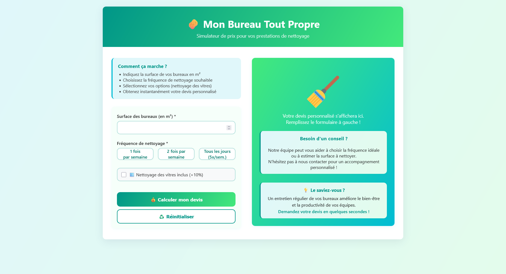

# 🧹 Mon Bureau Tout Propre — Simulateur de prix

<p align="center">
   
</p>

## 📚 Table des matières

- [Contexte du projet](#-contexte-du-projet)
- [Objectifs](#-objectifs)
- [Fonctionnalités](#-fonctionnalités)
- [Technologies utilisées](#-technologies-utilisées)
- [Modalités d'évaluation](#-modalités-dévaluation)
- [Livrables attendus](#-livrables-attendus)
- [Tester le projet](#-tester-le-projet)
- [Tests et validation](#-tests-et-validation)
- [Exemples de calcul](#-exemples-de-calcul)
- [Déploiement sur GitHub Pages](#-déploiement-sur-github-pages)
- [Fonctionnalités avancées implémentées](#-fonctionnalités-avancées-implémentées)
- [Structure du code](#-structure-du-code)

---

```bash
mon-bureau-tout-propre/
│
├── index.html          # Page principale avec le simulateur
├── styles.css          # Feuille de styles principale
├── app.js              # Logique JavaScript du simulateur
├── README.md           # Documentation du projet
│
│
├── docs/               # Documentation ou captures d'écran du projet
│   └── Mon-bureau-tout-propre.png
│
```

---

## 📌 Contexte du projet

L'entreprise fictive **Mon Bureau Tout Propre** propose des prestations de nettoyage de bureaux.  
Elle souhaite mettre à disposition de ses clients un **simulateur de prix interactif** directement intégré à son site vitrine.

L'objectif est de permettre aux utilisateurs d'estimer, en toute autonomie, le coût d'une prestation de nettoyage selon plusieurs critères :

- Surface des bureaux à nettoyer (en m²)
- Fréquence du nettoyage (1x/semaine, 2x/semaine, ou tous les jours)
- Option supplémentaire : nettoyage des vitres

Ce projet mobilise des compétences en **HTML**, **CSS** et **JavaScript vanilla** afin de créer un outil simple, ergonomique et responsive.

---

## 🎯 Objectifs

- Fournir un outil clair et rapide pour obtenir une estimation du prix.
- Valoriser la transparence de l'entreprise en affichant le calcul détaillé.
- Mettre en avant les résultats (HT, TVA, TTC) de manière lisible.

---

## ⚙️ Fonctionnalités

1. Formulaire interactif comprenant :

   - Champ de saisie de la surface (m²)
   - Sélection de la fréquence du nettoyage
   - Case à cocher pour inclure ou non le nettoyage des vitres

2. Calcul automatique du prix selon la formule :

   - **Tarif de base** : Surface × 1,50 €
   - **Majoration fréquence** : ×1 (1 fois/semaine), ×2 (2 fois/semaine), ×5 (tous les jours)
   - **Option vitres** : +10 % du prix
   - **Résultats affichés** :
     - Montant **HT**
     - Montant de la **TVA (20%)**
     - Montant **TTC**

3. Interface responsive (ordinateur, tablette, mobile).

---

## 🖥️ Technologies utilisées

- **HTML5** : structure sémantique de la page
- **CSS3** : mise en page responsive et design moderne
- **JavaScript (vanilla)** : logique de calcul et affichage dynamique

---

## ✅ Modalités d'évaluation

- Respect du cahier des charges
- Qualité du code (lisibilité, clarté, séparation HTML/CSS/JS)
- Expérience utilisateur (ergonomie et design responsive)
- Déploiement réussi sur **GitHub Pages**

---

## 📦 Livrables attendus

- Un **dépôt GitHub public** contenant :

  - `index.html`
  - `styles.css`
  - `app.js`
  - `README.md`

- Une version en ligne via **GitHub Pages**.

---

## 🚀 Tester le projet

1. Cloner le dépôt :

   ```bash
   git clone https://github.com/fannysaez/mon-bureau-tout-propre
   cd mon-bureau-tout-propre
   ```

2. **Ouvrir le projet**

   - Ouvrir `index.html` directement dans un navigateur, ou
   - Utiliser Live Server dans VS Code pour un développement optimal

3. **Tester le simulateur**
   - Saisir une surface (ex: 100 m²)
   - Sélectionner une fréquence de nettoyage
   - Cocher/décocher l'option vitres
   - Vérifier les calculs automatiques

---

## 🧪 Tests et validation

### Tests fonctionnels à effectuer :

1. **Validation des entrées**

   - [ ] Surface négative rejetée
   - [ ] Surface > 10000 m² limitée
   - [ ] Fréquence obligatoire

2. **Calculs de tarification**

   - [ ] Exemple 1 : 80 m², 2x/semaine, avec vitres = 316,80€ TTC
   - [ ] Exemple 2 : 150 m², 5x/semaine, sans vitres = 1350€ TTC

3. **Responsive Design**

   - [ ] Affichage correct sur desktop (> 768px)
   - [ ] Affichage correct sur tablette (768px - 481px)
   - [ ] Affichage correct sur mobile (< 480px)

4. **Expérience utilisateur**
   - [ ] Calcul en temps réel
   - [ ] Messages d'erreur appropriés
   - [ ] Navigation fluide
   - [ ] Animations fonctionnelles

---

## 📝 Exemples de calcul

### Exemple 1

- **Surface** : 80 m²
- **Fréquence** : 2 fois par semaine
- **Options** : Vitres incluses

**Calcul détaillé :**

1. Tarif de base : 80 × 1,50 = 120 €
2. Fréquence : 120 × 2 = 240 €
3. Options (vitres +10%) : 240 × 1,10 = 264 €
4. **Résultat final :**
   - Montant HT = 264 €
   - TVA (20%) = 52,80 €
   - **Montant TTC = 316,80 €**

### Exemple 2

- **Surface** : 150 m²
- **Fréquence** : tous les jours (5 fois par semaine)
- **Options** : pas de vitres

**Calcul détaillé :**

1. Tarif de base : 150 × 1,50 = 225 €
2. Fréquence : 225 × 5 = 1125 €
3. Options : Pas d'option → 1125 €
4. **Résultat final :**
   - Montant HT = 1125 €
   - TVA (20%) = 225 €
   - **Montant TTC = 1350 €**

---

## 🚀 Déploiement sur GitHub Pages

1. **Pusher le code sur GitHub**

   ```bash
   git add .
   git commit -m "feat: Simulateur Mon Bureau Tout Propre"
   git push origin main
   ```

2. **Activer GitHub Pages**

   - Aller dans Settings → Pages
   - Source : Deploy from branch
   - Branch : main / (root)
   - Save

3. **Accéder au site**
   - URL : `https://fannysaez.github.io/mon-bureau-tout-propre/`

---

## 🎨 Fonctionnalités avancées implémentées

- **Calcul en temps réel** : Mise à jour instantanée des résultats
- **Validation intelligente** : Messages d'erreur contextuels
- **Design moderne** : Dégradés, animations et micro-interactions
- **Interface responsive** : Adaptation parfaite à tous les écrans
- **Accessibilité** : Navigation clavier et contraste optimisés
- **Performance** : Code optimisé et structure modulaire

---

## 📊 Structure du code

### HTML (index.html)

- Structure sémantique et accessible
- Formulaire avec validation côté client
- Zones d'affichage des résultats

### CSS (styles.css)

- Design system cohérent
- Responsive design avec breakpoints
- Animations et transitions fluides
- Architecture CSS modulaire

### JavaScript (app.js)

- Classe PriceCalculator avec méthodes organisées
- Gestion des événements et validation
- Calculs conformes au cahier des charges
- Formatage automatique des prix

---

✨ **Projet prêt pour la production et le déploiement !**
